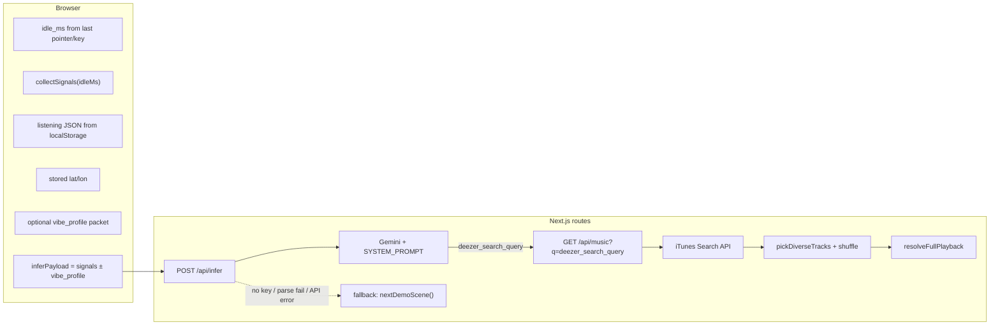

# Input QC report — mood inference & music recommendation

**Role:** Senior engineering / QA review of **how inputs flow** from the browser into mood framing and into track selection.  
**Date:** 2026-04-23  
**Code references:** [`lib/signals.ts`](./lib/signals.ts), [`lib/listening.ts`](./lib/listening.ts), [`lib/vibe-profile-storage.ts`](./lib/vibe-profile-storage.ts), [`app/page.tsx`](./app/page.tsx), [`app/api/infer/route.ts`](./app/api/infer/route.ts), [`app/api/music/route.ts`](./app/api/music/route.ts), [`lib/demo-scenes.ts`](./lib/demo-scenes.ts).

---

## 1. End-to-end data flow

**Takeaway:** “Mood” is entirely **model-produced text** from whatever JSON you send; “recommendation” is **only** whatever **iTunes** returns for **`deezer_search_query`**, post-processed for diversity and optional full playback—not a second ranking pass on mood Fit.

---

## 2. Inputs that actually reach the model

| Input | Present in `SignalsPacket` | Used for mood text? | Used for `deezer_search_query`? | QC notes |
|--------|---------------------------|---------------------|-----------------------------------|-----------|
| **UTC timestamp** (`collected_at_iso`) | Yes | Should be ignored for local time-of-day | N/A | Prompt explicitly warns: do **not** infer local mood from UTC—good guardrail ([`app/api/infer/route.ts`](./app/api/infer/route.ts)). |
| **Local clock** (`local_time_24h`, `local_hour_24`, `local_time_period`) | Yes | Intended primary time signal | Via single JSON output | **Strong:** `local_time_period` buckets night/morning/etc. consistently ([`lib/signals.ts`](./lib/signals.ts)). |
| **Timezone, day_of_week** | Yes | Yes | Via model | Reliable. |
| **`locale`** | Yes | Possibly tone/language | Query language not enforced as English-only in prompt (plan often asked for EN keywords)—minor ambiguity. |
| **Geo / weather** | Optional | Yes when present | Via model | If user skipped location: `limitations` includes `no_geolocation` / `no_weather`—model instructed not to invent weather. |
| **`device.online`, battery, charging, ua_mobile** | Yes | Prompt says blend with profile | Via model | Online/offline **not** in packet as strongly as §11 banner on client—model still sees `navigator.onLine` snapshot. |
| **`behavior.visibility`** | Yes | Useful for foreground vs background | Via model | Single snapshot per cycle—not a stream. |
| **`behavior.idle_ms_estimate`** | Yes | Meaningful **after** first interaction | Via model | **Nuance:** `lastInteract` is `0` until first pointer/key event; code uses `lastInteract \|\| Date.now()` so **first-cycle idle is forced to ~0**, not “time since page open.” That understates “idle” until the user touches the page ([`app/page.tsx`](./app/page.tsx)). |
| **`listening` (FIFO + aggregate_hint)** | Usually yes | Prompt: blend profile + live + history | Via model | **Weak genre signal:** `recent_plays` rarely include **`genres`** because [`recordPreviewListen`](./lib/listening.ts) is called **without `genres`** from [`page.tsx`](./app/page.tsx). So `aggregate_hint.top_genres` stays **empty** unless populated elsewhere—history is mostly **title/artist only**. |
| **`limitations[]`** | Yes | Model should acknowledge gaps | Via model | Good explicit degradation tokens. |
| **`vibe_profile`** (quiz + bio) | If `hasMeaningfulProfile` | Prompt: **primary prior** for taste | Strong steering for query | **Duplication:** `summary_for_model` is **inside** `JSON.stringify(signals)` **and** appended again in `buildPrompt`—redundant but harmless. |

---

## 3. Mood inference quality (QC)

### What works well

- **Structured outputs** (`mood_label`, `weather_metaphor`, `notification_line`, etc.) give users an audit trail in UI (`signals_used_for_read`, `moment_arc`).
- **Time-of-day grounding** uses explicit **`local_time_period`** instead of inferring from UTC—reduces a common LLM mistake.
- **Safety** flag for distress is wired to UI copy.
- **Console observability:** [`app/page.tsx`](./app/page.tsx) logs `cycle_id`, `_source`, mood, track count via `console.table`.

### Gaps and risks

| Issue | Severity | Detail |
|--------|-----------|--------|
| **Passive-only claim vs profile** | Medium | Optional **`vibe_profile`** is **explicit user-supplied** taste data (quiz, MBTI, zodiac, about). That is valuable for personalization but **not** “pure passive inference.” Product copy should stay honest: mood read blends **device signals + optional self-report**. |
| **First-load idle** | Low | Idle time is ~0 until interaction—acceptable for “moment” reads; misleading if you interpret idle as “time since load.” |
| **Listening history without genres** | Medium | Plan intent (genre skew for adjacent recommendations) is **underfed**: rows lack genre tags from catalog. |
| **Fallback inference ignores all signals** | **High** when triggered | If `GEMINI_API_KEY` is missing, JSON parse fails, or Gemini throws, [`nextDemoScene()`](./lib/demo-scenes.ts) returns **rotating canned** `InferenceResult` + SoundHelix tracks—**no correlation** to live `SignalsPacket`. UI still “works,” but **input QC fails completely** for that session. Same if client only receives fallback without knowing—`_source` is returned but **not surfaced** prominently in UI. |
| **Minimal schema validation on server** | Medium | Infer route accepts whatever parses as JSON; missing `safety` or wrong types could slip through until UI breaks. |

---

## 4. Recommendation path quality (query → tracks)

### Step A — Query generation (LLM)

The model outputs **`deezer_search_query`** (name kept from legacy spec) with **hard stylistic constraints**:

- Push toward **mainstream chart / radio / era** keywords.
- **Avoid** lofi, ambient, study, generic instrumental—unless distress path.

**QC assessment**

- **Pros:** Reduces bland “ambient study” sludge; fits **iTunes** catalog bias toward popular recordings.
- **Cons:** Strong bias can **override** subtle signal-driven moods (e.g. “soft rainy evening” might still map to “2010s pop radio hits” if the model overfits the rules). There is **no automated check** that the query terms align with `mood_label` or `limitations`.

### Step B — Retrieval (`/api/music`)

- **iTunes** `limit=40`, filter **`previewUrl` present**, then **`pickDiverseTracks`**: shuffle + up to **3** distinct primary artists.
- **Random shuffle** means **repeatable queries still yield non-deterministic** track sets—QC noise for demos and testing.
- **No mood-aware re-ranking:** iTunes relevance is lexical + popularity; the app does not score tracks against `SignalsPacket` or `InferenceResult`.
- **Errors / empty previews:** Route falls back to [**bundled demo tracks**](./lib/demo-scenes.ts)—again **decoupled** from user inputs.

---

## 5. Verdict: are inputs “considered properly”?

| Layer | Verdict | Explanation |
|--------|---------|-------------|
| **Signal construction** | **Good** | Time/weather/device/behavior/listening/limitations are assembled deliberately; optional profile merge is explicit. |
| **Mood narrative (LLM)** | **Good / mixed** | Strong time and weather guardrails; listening + idle weaker as noted; **fallback paths discard inputs**. |
| **Search query vs signals** | **Mixed** | Single JSON blob ties mood text to **one** query string, but prompt **biases query shape** toward mainstream iTunes-friendly strings—may dilute signal fidelity. |
| **Final tracks vs mood** | **Weak coupling** | Tracks come from **iTunes + random diversity**, not from a second-stage scorer—so “recommendation quality” is **query quality + catalog luck**, not guaranteed alignment. |

**Bottom line:** For **live Gemini** responses, inputs are **mostly** wired sensibly into the **same** model call that both describes mood and emits the search string, which is the right architecture for a thin client. The main **QC failures** are: (1) **fallback** scenarios that **ignore** `SignalsPacket`, (2) **listening history** missing **genre enrichment**, (3) **non-deterministic** track picking, and (4) **no validation** that the search query remains consistent with `limitations` (e.g. no weather should not still produce weather-specific query terms—left entirely to the model).

---

## 6. Recommended hardening (priority order)

1. **Surface `_source`** (`gemini` vs `fallback_*`) in the results UI when not live—so demos do not misrepresent “reading the room.”
2. **Pass genres** into `recordPreviewListen` when available from metadata (or fetch once per track id)—to activate `aggregate_hint.top_genres`.
3. **Seed shuffle** with `cycle_id` or query hash for **reproducible** QA runs (optional dev flag).
4. **Structured validation** (e.g. Zod) on `InferenceResult` before returning from `/api/infer`.
5. **Second-pass sanity check** (rule-based or tiny LLM): if `limitations` contains `no_weather`, strip weather tokens from `deezer_search_query`—optional belt-and-suspenders.

---

*This document is descriptive QA only; it does not change application behavior.*
